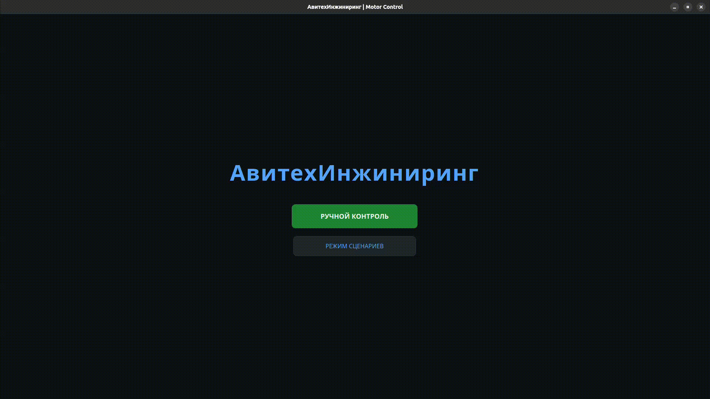

# 🚀 Avitech PropTest System v1.2

**Avitech PropTest** is a professional Python-based desktop application designed for real-time monitoring and control of propulsion test stands. It provides high-speed data visualization and manual PWM control for BLDC motor analysis.

<p align="center">
  
</p>


## ✨ Key Features

* **Real-time Monitoring:** Visualizes Current (A), Voltage (V), and RPM with high precision.
* **Manual Control:** Smooth PWM signal control (1000-2000µs) via a dedicated slider.
* **Data Logging:** One-click CSV recording for post-test analysis and performance reporting.
* **High Performance:** Built with `PyQtGraph` and `PySide6` for 60FPS UI responsiveness.
* **Asynchronous Engine:** Dedicated Serial worker thread to ensure stable hardware communication without UI freezes.

---

## 🛠 Tech Stack

* **Language:** Python 3.10+
* **GUI Framework:** PySide6 (Qt for Python)
* **Graphics:** PyQtGraph (Optimized for real-time data)
* **Communication:** PySerial (115200 Baud)

---

## 🚀 Quick Start

### 1. Prerequisites
Ensure you have Python installed. Then, install the required dependencies:

```bash
pip install -r requirements.txt
```
2. Hardware Setup
The system expects data from the microcontroller in the following format via Serial:
Voltage;RPM;Current\n (e.g., 22.4;15000;45.2)

4. Run the App
```   
python win50.py
```

⚠️ Safety Disclaimer
This software controls high-speed rotating equipment. Always ensure:
1. Your test stand is physically secured and shielded.
2. A physical "Emergency Stop" or power disconnect is within reach.
3. You are wearing appropriate safety gear.


⚖️ Legal & Copyright
Copyright © 2026 Avitech Engineering. All rights reserved.
This software is the proprietary property of Avitech Engineering. No part of this software may be copied, distributed, modified, or used for commercial purposes without express written permission from the copyright holder. This repository is for demonstration and archival purposes only.
